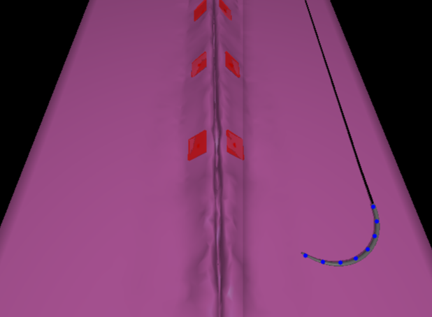

# Camera coordinate frames


## Important coordinate frames

The virtual environment includes a pair of stereo cameras that are fixed with respect to a camera frame. When commanding the virtual camera arm, the relation between the cameras and the frame will remain fixed, i.e. , transformations `T_FL` and `T_FR` do not change when moving the virtual ECM.  Finding a transformation between the needle local coordinate frame and the left image plane can be accomplish via the following block of code:

```python

  	# Get pose for the needle and the camera
    T_WN = pm.toMatrix(scene.needle_measured_cp())    # Needle to world
    T_FL = pm.toMatrix(ambf_cam_l.get_T_c_w())        # CamL to CamFrame
    T_WF = pm.toMatrix(ambf_cam_frame.get_T_c_w())    # CamFrame to world
    
    # Get image
    img = saver.left_frame

   	# Calculate transformation between the needle and left coordinate frames
    T_WL = T_WF.dot(T_FL)
    T_LN = inv(T_WL).dot(T_WN)
```


## Intrinsic parameter matrix.

The intrinsic parameters of cameras in AMBF are established in OpenGL fashion using the vertical field view angle (`fva`) which describes the perspective frustum. The intrinsic matrix (I) can be calculated through the following equations: 


Where `fx` and `fy` are the focal length in pixels in the x and y directions. `W` and `H` are the width and height of the image produced in pixels. `cx` and `cy` describe the x and y position of the camera principal point. Extrinsics information is obtained from the relative transformation between the cameras and world frame. 


The camera parameters, such as `fva`, `near` and `far` plane, are found in its ADF definition. For this repo, the cameras are defined in the [World](./../ADF/world/world_stereo.yaml) file. The parameters `cx` and `cy` depend upon the image size of the published camera stream. It defaults to `640 x 480` but can be changed by setting an appropriate field as shown [here](https://github.com/surgical-robotics-ai/surgical_robotics_challenge/blob/master/ADF/world/world_stereo.yaml#L57), .

## Difference between AMBF and Opencv camera conventions 

To use Opencv 3D calibration functions, it is necessary to convert between the AMBF and the Opencv camera conventions. As seen in the figure below, the AMBF camera frames has the minus X axis towards the image plane, Y towards the right (horizontal axis) and Z upwards (vertical axis). On the other hand, Opencv has the Z axis towards the image plane, the X axis toward the right and the minus Y axis upward. Conversion, from the AMBF convention to the OPENCV convention can be achieved with

````python
    F = np.array([[0, 1, 0, 0], [0, 0, -1, 0], [-1, 0, 0, 0], [0, 0, 0, 1]])
    T_CN_CV2 = F.dot(T_CN_AMBF)
````
where `T_CN_AMBF` is the extrinsic camera matrix.


## Examples

A full example of how to use these transformation matrices to project 3D points from the needle into the image can be found in [project_needle_points.py](./../scripts/surgical_robotics_challenge/examples/project_needle_pts.py). 



