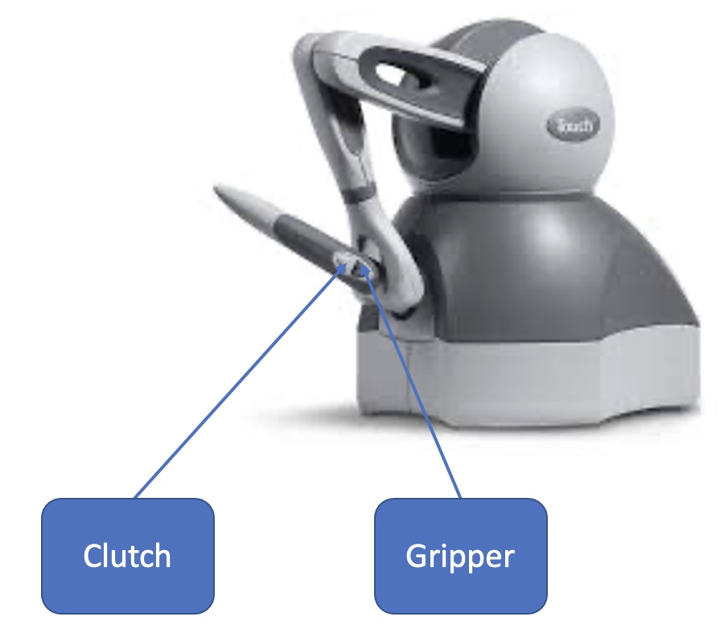
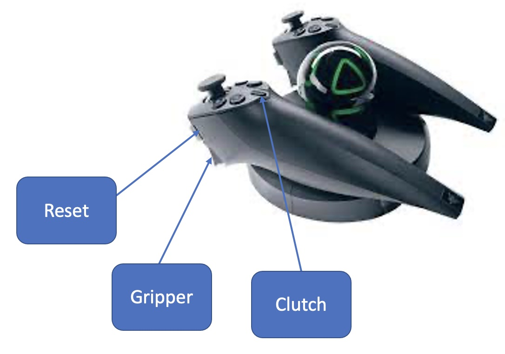

# A supplemental specification for teleoperation using AMBF and external control devices

# 1. Teleoperation devices

## Install drivers

If you have questions with respect to hardware driver installation, please check https://github.com/JackHaoyingZhou/daVinci_simulation.

In `src/razer_hydra` and `src/ros_geomagic` folders, detailed instructions are provided.

## How to enable teleoperation devices

In a separate terminal, run following commands directly to enable the devices:

### Raze Hydra

```bash
roslaunch razer_hydra hydra.launch
```

### Geomagic Touch

```bash
roslaunch geomagic_control geomagic_headless.launch
```

### MTM

It would require some acquaintance of dVRK and/or CRTK as prerequisite. Please check the following wiki for more information if you are interested:
https://github.com/jhu-dvrk/sawIntuitiveResearchKit/wiki/FirstSteps

If you have successfully installed dVRK and have physical MTMs, please run following command to enable MTM firstly:

```bash
rosrun dvrk_robot dvrk_console_json -j <json file for MTMs>
```

# 2. How to run teleoperation with AMBF

## Run AMBF simulation:

```bash
./run_environment.sh
```

** If you install the integrated environment from https://github.com/JackHaoyingZhou/daVinci_simulation, then, please run

```bash
./run_environment0.sh
```

## Run teleoperation

Firstly, go to `teleoperation` folder via running

```bash
cd ~/surgical_robotics_challenge/scripts/teleoperation
```

### Geomagic

```bash
./geomagic_psms_teleop.sh
```

### Razer Hydra

HydraL-PSM1 teleop:

```bash
./hydral_psm1_teleop.sh
```

HydraR-PSM2 teleop:

```bash
./hydrar_psm2_teleop.sh
```

HydraL-PSM1-HydraR-PSM2 teleop:
```bash
./hydra_psm_pair_teleop.sh
```

### MTM

MTML-PSM1 teleop:

```bash
./mtml_psm1_teleop.sh
```

MTMR-PSM2 teleop:

```bash
./mtmr_psm2_teleop.sh
```

MTML-PSM1-MTMR-PSM2 teleop:
```bash
./mtm_psm_pair_teleop.sh
```

## button instructions

** Note: 

`clutch` : if you are on "clutch" status, you are free to move your teleoperation device but the PSMs in AMBF will not follow, therefore you can extend your workspace.

### Geomagic



| Button Motion               | Action            |
|-----------------------------|-------------------|
| push/hold on clutch button  | Clutch            |
| push clutch button twice    | Switch PSM arm    |
| push/hold on gripper button | close the gripper |

### Razer Hydra



| Button Motion                                                | Action                                                                                                                    |
|--------------------------------------------------------------|---------------------------------------------------------------------------------------------------------------------------|
| push/hold on clutch button                                   | Clutch                                                                                                                    |
| push/hold on reset button and clutch button at the same time | Reset your Razer Hydra base frame the same as your current pose if you feel uncomfortable with default Hydra frame setup  |
| push/hold on gripper button                                  | close the gripper                                                                                                         |
 

# Reference

Reference of this work:

```bibtex
@article{munawar2022open,
  title={Open Simulation Environment for Learning and Practice of Robot-Assisted Surgical Suturing},
  author={Munawar, Adnan and Wu, Jie Ying and Fischer, Gregory S and Taylor, Russell H and Kazanzides, Peter},
  journal={IEEE Robotics and Automation Letters},
  volume={7},
  number={2},
  pages={3843--3850},
  year={2022},
  publisher={IEEE}
}
```
